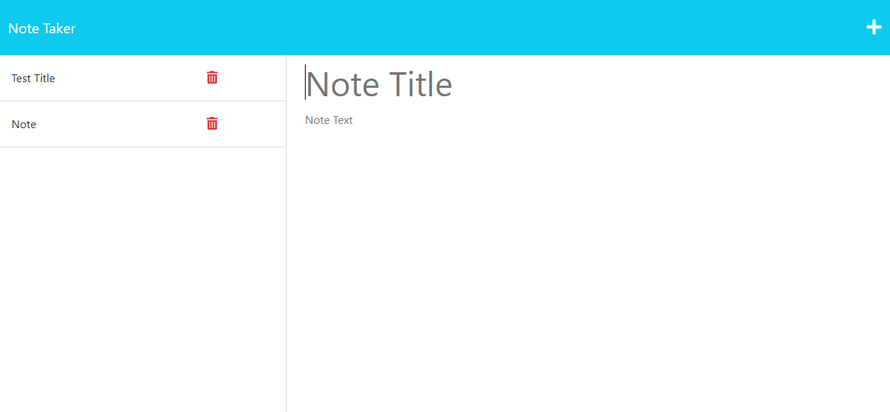

# note-taker

=============================

## Description

An application that can be used to write and save notes.

- What was your motivation?
  - I wanted to build server routes to make the note taker application functional.
- Why did you build this project?
  - I wanted to learn more about using express.js
- What problem does it solve?
  - The application allows the user to store notes and delete them.
- What did you learn?
  - I learned how to construct a get, post and delete route. I also learned more about using the fs package to read and write files in js.

## Installation

- Installation not necessary.
- Please follow the link provided: https://notetaker-ab.herokuapp.com/

## Usage

- On the homepage, select "Get Started"
- To add a note type a title and the text, then select the save icon on the top right.
- You can delete notes by selecting the trashcan next to the note you want to remove.

  
